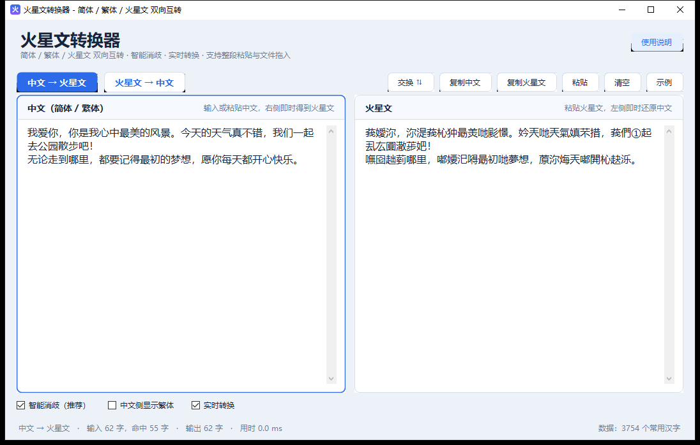
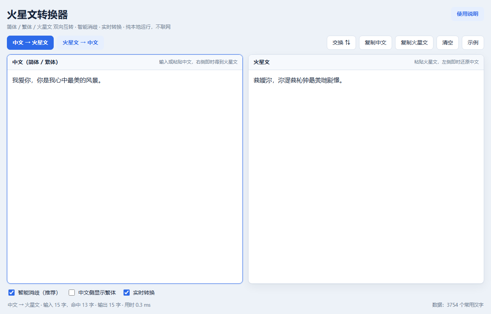
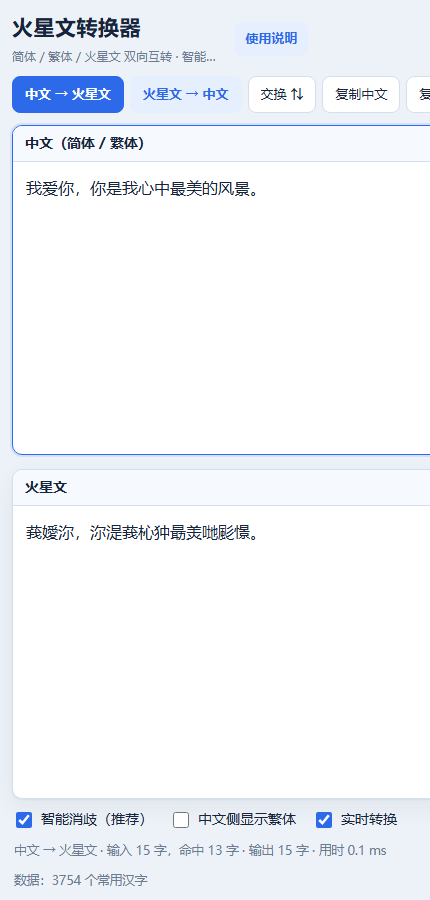

# 火星文转换器（中文简体 / 繁体 ⇄ 火星文）

参考 [huoxingwen.qianwanku.com](http://huoxingwen.qianwanku.com/) 的转换规则实现的三端转换工具：**Windows 桌面版 + 安卓版 + 网页版**，并在此基础上加了**智能消歧**——火星文还原中文时按上下文自动选字，比在线工具的「首个匹配」准得多。

三端共用同一份转换引擎与同一份数据：安卓版的 `assets/index.html` 与网页版文件字节完全一致（SHA-256 校验通过），三端结果必然相同。

## 效果预览

| Windows 桌面版 | 安卓版 |
| --- | --- |
|  |  |

| 网页版（桌面浏览器） | 网页版（手机） |
| --- | --- |
|  |  |

## 下载使用

到 [Releases](https://github.com/Flyoverisblind/huoxingwen-converter/releases/latest) 下载对应平台的文件：

| 平台 | 文件 | 说明 |
| --- | --- | --- |
| Windows | `火星文转换器.exe` | 免安装单文件，双击即用（约 640 KB，依赖系统自带 .NET Framework 4.x，Win8.1/10/11 已内置） |
| Android | `火星文转换器-v1.0-android.apk` | Android 5.0+，601 KB，**不申请任何权限**（连联网权限都没有） |
| 任意平台 | `火星文转换器.html` | 单文件网页版，双击用浏览器打开即可，支持离线与手机浏览器 |
| 全平台 | `火星文转换器-v1.0-全平台测试包.zip` | 上面三个 + 使用说明 |

> Windows 首次运行若出现「Windows 已保护你的电脑」提示，点「更多信息 → 仍要运行」即可（程序未购买代码签名证书，属正常提示）。
> 安卓安装时若提示「禁止安装未知来源应用」，在弹窗里点「设置」允许本次安装。

## 功能特性

- **双向实时转换**：任意一侧输入，另一侧立刻出结果（60 ms 防抖），支持整段多行文本。
- **智能消歧**：火星文一个字常对应多个汉字（如「妑」= 芭/吧/巴/把/爸），用字频 + 常用词二元组统计 + 动态规划求全局最优；关闭后与在线工具「首个匹配」结果完全一致。
- **简体 / 繁体**：中文一侧可在简繁之间切换，火星文也能由繁体字生成。
- **安卓端原生增强**：「粘贴」一键读系统剪贴板，「分享」调用系统分享面板。
- **工程细节**：文件拖入、复制/粘贴/交换/清空/示例、字数与命中统计、耗时统计、焦点高亮、DPI 感知、找不到的文字原样保留。

## 转换规则与数据

- 三张平行对照表（简体 3754 字 / 繁体 / 火星文）整理自参考站点的 `huoxing.js`，索引一一对应，转换方向与其完全一致；反查候选顺序也一致（繁体表 → 火星文表 → 原字）。
- 智能消歧的统计量由 [jieba](https://github.com/fxsjy/jieba) 词典（348,974 个中文词条）离线统计：字频 928 条、二元组 120,282 条，压缩后 549 KB，内嵌进 exe / html / apk。
- 打分模型：`得分 = 字频项(log(1+freq) × 1/4) + 词组项(log(1+weight) × 1/2)`，用 Viterbi 式动态规划求整句最优解。

## 准确率实测

火星文还原中文（中文 → 火星文 → 还原中文，往返评测）：

| 语料 | 首个匹配（在线工具） | 智能消歧 |
| --- | --- | --- |
| 4000 个常用词：整词完全正确率 | 72.00% | **99.75%** |
| 4000 个常用词：字级准确率 | 85.75% | **99.88%** |
| 200 个句子（词间有标点）：字级准确率 | 90.47% | **99.94%** |
| 585 个句子（随机常用词直接连写、无标点，最苛刻）：字级准确率 | 85.84% | **98.76%** |
| 3754 个孤立单字（无任何上下文） | 85.88% | 86.55% |

回归验证：与参考实现（Node 复刻 `huoxing.js`）逐字符比对，全部简体表 3754 字、全部源字符 6618 字、400 句随机文本、中英数字 emoji 混排，**16/16 项完全一致**。

安卓版实测：网易 MuMu 模拟器 Android 15（WebView 110）安装启动正常，`中文 → 火星文` 与 `火星文 → 中文（智能消歧）` 双向正确，无任何权限申请，apksigner v1+v2+v3 与 zipalign 校验通过。

## 项目结构

```
src/                   Windows 桌面版（C# / WinForms，无需 Visual Studio，用系统自带 csc.exe 编译）
  Conv.cs              转换引擎：对照表、智能消歧动态规划、简繁互转
  MainForm.cs          界面：自绘卡片、圆角按钮、双向实时转换
  Program.cs / TestCli.cs   入口与命令行模式（-cli，供自动化测试）
  app.manifest / app.ico    DPI 感知清单与应用图标

android/app/           安卓版（Java + WebView 壳，不需要 Gradle）
  AndroidManifest.xml  清单（无任何权限）
  java/.../MainActivity.java   WebView 壳、状态栏配色、返回键处理
  java/.../WebBridge.java      注入页面的原生能力（读剪贴板 / 系统分享）
  java/.../ShareTask.java      系统分享任务
  res/                 图标（各密度 + 自适应）、主题、字符串

tools/                 构建与验证脚本
  gen_data.mjs         由 jieba 词典生成 build/dict.tsv 与 build/smart.gz
  build.ps1            一键构建 Windows exe（.NET Framework 自带 csc.exe）
  build_apk.ps1        一键构建安卓 apk（aapt2 + javac + d8 + zipalign + apksigner）
  gen_html.mjs         生成单文件网页版（同时作为安卓版的 assets）
  engine.mjs           参考实现（Node，作为验证基准）
  verify.mjs / verify_web.mjs   与参考实现逐字符比对
  eval.mjs / tune.mjs / tune2.mjs   反查准确率评测与参数调优
  make_icon.py / make_android_icons.py   生成图标
  shot.ps1             桌面版自动化 UI 截图

build/                 构建输出（仓库只保留运行必需的数据文件）
  dict.tsv             三张对照表（33 KB）
  smart.gz             智能消歧统计表（549 KB）
docs/images/           README 用截图
```

## 从源码构建

依赖：Node.js（生成数据/网页版）、Python 3 + Pillow（生成图标）、JDK 8+、Android SDK（`platforms;android-34` 与 `build-tools;34.0.0`，仅安卓需要）。Windows 版直接用系统自带的 .NET Framework 编译器，无需安装 Visual Studio。

```powershell
# Windows 桌面版 -> build/火星文转换器.exe
powershell -NoProfile -ExecutionPolicy Bypass -File tools/build.ps1

# 网页版 -> build/火星文转换器.html（同时也是安卓版的 assets）
node tools/gen_html.mjs

# 安卓版 -> build/火星文转换器-v1.0-android.apk
powershell -NoProfile -ExecutionPolicy Bypass -File tools/build_apk.ps1

# 回归验证：与参考实现逐字符比对
node tools/verify.mjs
node tools/verify_web.mjs
```

说明：

- `build/dict.tsv`、`build/smart.gz` 已随仓库提供，**普通构建不需要重新生成**；若要自己重新统计，执行 `python -m pip download jieba --no-deps --no-binary :all:` 解开词典放到 `_ref/jieba_dict.txt`，再运行 `node tools/gen_data.mjs`。
- `aapt2` 对中文路径支持不佳，安卓构建脚本会先把工程复制到英文临时目录，构建完再把 apk 拷回 `build/`。
- 签名：仓库不包含私钥，`build_apk.ps1` 会在 `android/keystore/` 下自动生成一个自签名证书（口令 `huoxingwen`）。**正式发布请换用自己的证书并妥善保管私钥**，否则无法覆盖升级。

## 已知限制

- 表外生僻字、标点、英文数字、emoji 原样保留，不转换。
- 汉字 → 火星文的写法是固定的（一个字一个写法），所以没有「随机变体」。
- 孤立的单个火星文字没有上下文，任何工具都无法百分之百还原（智能消歧会退化为「最常用候选」）。
- 极少数场合仍可能判断偏差，例如「今天的天气」偶尔会被还原成「今天地天气」（火星文里「哋」同时对应「的」和「地」，程序只能按常用词统计去猜）。

## 许可

代码以 MIT License 发布，详见 [LICENSE](LICENSE)。对照表数据整理自公开的火星文转换规则，字频与词组统计由 jieba 词典（MIT）生成，仅供学习与个人使用。
